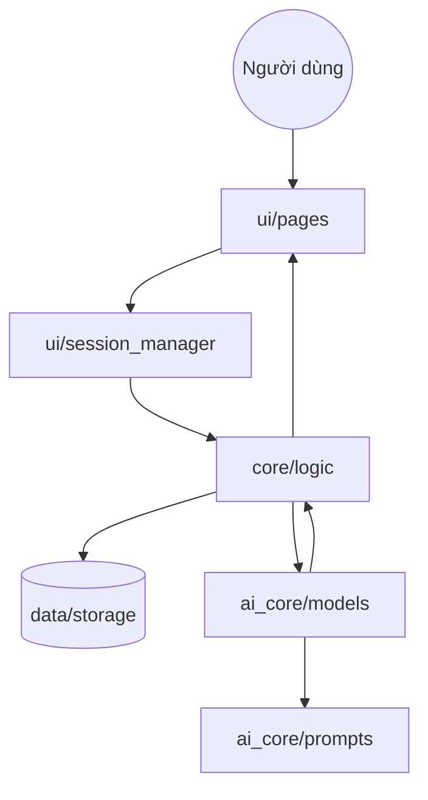

# 📁 InternHub Project Structure Guide (Detailed)

Tài liệu này cung cấp cái nhìn chi tiết về cấu trúc mã nguồn và phân công nhiệm vụ trong team, giúp phối hợp nhịp nhàng, tránh chồng chéo và duy trì code sạch.

---

## 👥 1. Phân công nhân sự (Roles & Responsibilities)

| Vai trò | Phụ trách chính | Phạm vi công việc | Thư mục làm việc |
| :--- | :--- | :--- | :--- |
| **🎨 App Lead** | Giao diện & UX | Xây dựng UI, Visualization, Quản lý Session, Navigation. | `ui/`, `assets/`, `app.py` |
| **🤖 AI Lead** | LLM & AI Engine | Prompt Engineering, RAG (ChromaDB), Chấm điểm & Gợi ý AI. | `ai_core/`, `data/vector_store/` |
| **📊 Data Lead** | Logic & Dữ liệu | Xử lý dữ liệu thô, Schema Validation, Thuật toán tính điểm năng lực. | `core/`, `data/`, `utils/` |

---

## 📂 2. Chi tiết chức năng thư mục

### 🤖 `ai_core/` (AI Processing Layer)
Lớp xử lý trí tuệ nhân tạo, tương tác trực tiếp với các mô hình ngôn ngữ lớn (LLM).
- `prompts.py`: Quản lý tập trung System & User Prompts. **Quy tắc: Không viết prompt trực tiếp trong file UI.**
- `grader.py`: Logic sử dụng AI để chấm điểm câu trả lời và cung cấp phản hồi chi tiết.
- `recommender.py`: Hệ thống gợi ý lộ trình dựa trên phân tích điểm mạnh/yếu của ứng viên.
- `llm_client.py`: Quản lý kết nối, retry logic và tham số cấu hình cho Google Gemini/OpenAI.

### ⚙️ `core/` (Business Logic Layer)
Lớp xử lý nghiệp vụ, đảm bảo dữ liệu được chuẩn hóa và tính toán chính xác trước khi hiển thị.
- `competency_engine.py`: Thuật toán cốt lõi tính toán ma trận năng lực (Competency Matrix).
- `data_loader.py`: Xử lý I/O dữ liệu (JSON, CSV, Database), đảm bảo dữ liệu sẵn sàng cho ứng dụng.
- `schema_validator.py`: Sử dụng Pydantic/JSON Schema để kiểm tra tính toàn vẹn của dữ liệu đầu vào.
- `test_generator.py`: Logic tạo kịch bản phỏng vấn và bộ câu hỏi dựa trên Skillset.

### 🎨 `ui/` (Presentation Layer)
Giao diện người dùng xây dựng trên Streamlit, phân tách giữa logic hiển thị và trạng thái.
- `pages/`: Chứa các trang riêng biệt (Dashboard, Interview, Assessment). Đánh số thứ tự để Streamlit sắp xếp sidebar.
- `components/`: Các Widget dùng chung như Navbar, Sidebar, Charts (Plotly) và thông báo.
- `session_manager.py`: Tập trung quản lý `st.session_state` để tránh lỗi mất dữ liệu khi chuyển trang.

### 📊 `data/` (Data Storage & Assets)
- `vector_store/`: Lưu trữ cơ sở dữ liệu Vector (ChromaDB) phục vụ cho RAG.
- `schemas/`: Định nghĩa cấu trúc dữ liệu chuẩn (JSON Schema).
- `mock/`: Dữ liệu giả lập phục vụ quá trình phát triển khi chưa có DB/API thật.
- `raw/` & `processed/`: Nơi lưu trữ dữ liệu đầu vào chưa xử lý và dữ liệu đã qua tinh lọc.

### 🛠️ `utils/` & `tests/` (Infrastructure & Quality)
- `utils/logger.py`: Hệ thống ghi log tập trung (Loguru) hỗ trợ debug và theo dõi lỗi.
- `utils/helpers.py`: Các hàm tiện ích bổ trợ (Xử lý chuỗi, Format thời gian, Xử lý file).
- `tests/`: Các bộ Unit Test và Integration Test sử dụng Pytest.

---

## 🔄 3. Luồng dữ liệu (Data Flow)

---

## 🛠️ 4. Quy tắc phối hợp (Collaboration Rules)

1.  **Giao diện & Logic:** App Lead tuyệt đối không viết logic tính toán hay prompt AI trong file UI. Hãy yêu cầu Data/AI Lead cung cấp hàm/API tương ứng.
2.  **Dữ liệu:** Luôn validate dữ liệu qua `core/schema_validator.py` trước khi lưu vào `data/` hoặc gửi cho AI.
3.  **Prompt:** Mọi thay đổi về Prompt phải được thực hiện trong `ai_core/prompts.py` để dễ dàng tinh chỉnh và versioning.
4.  **Cấu hình:** Sử dụng `config.py` và `.env` cho mọi hằng số, API key. Tuyệt đối không hardcode.
5.  **Kiểm thử:** Đảm bảo chạy `pytest` và kiểm tra log trong quá trình phát triển.

---

